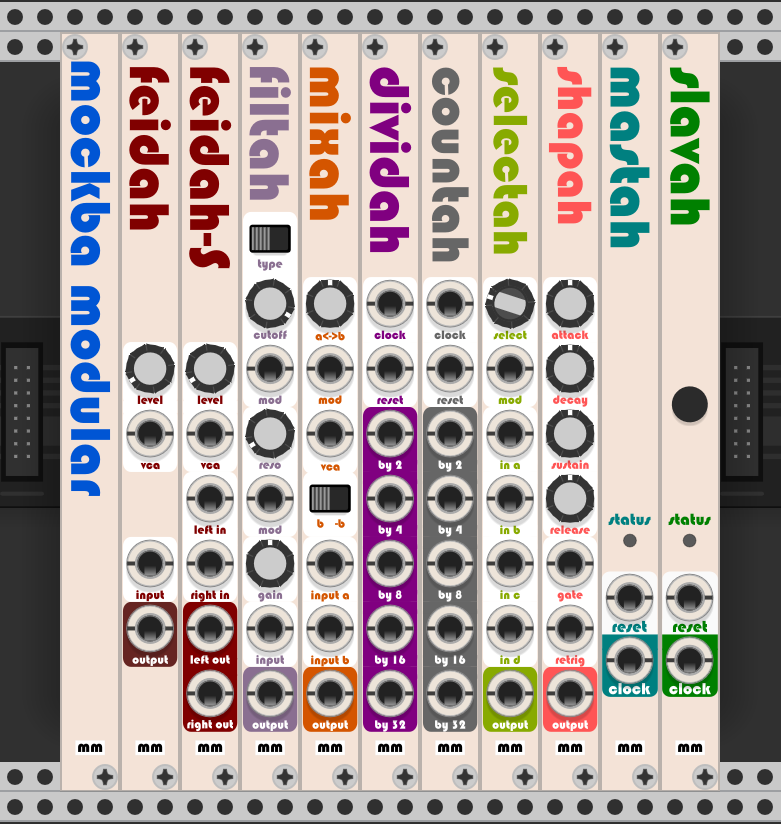
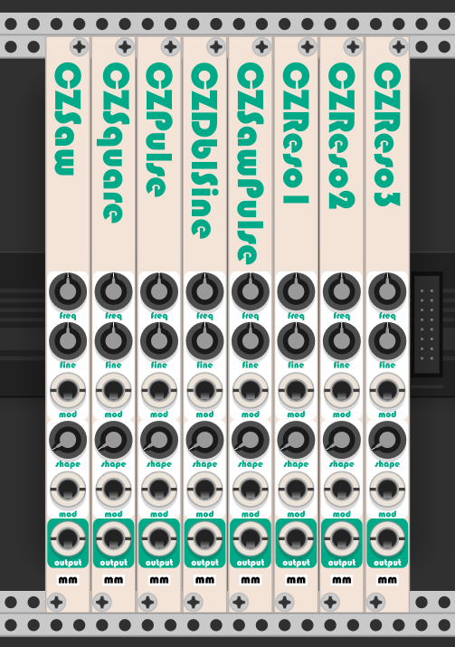
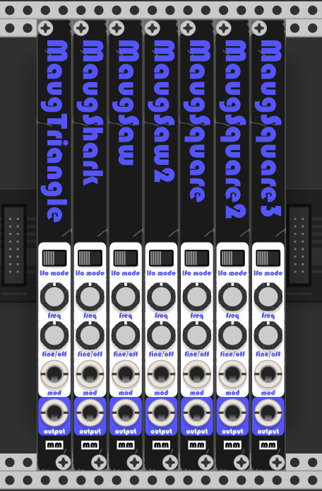
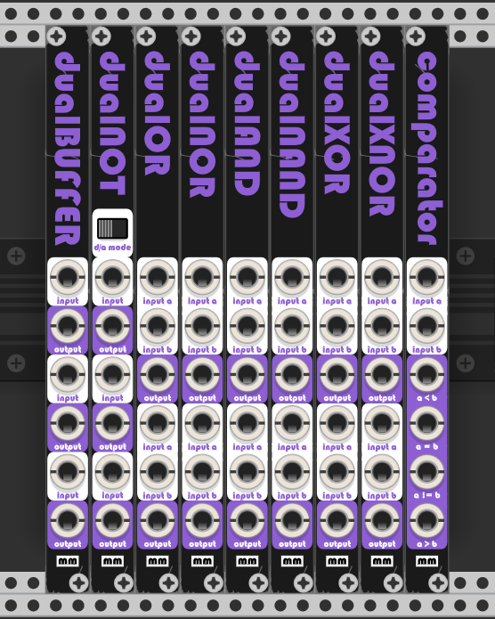

# Mockba Modular
Mockba's modules for VCV Rack: https://vcvrack.com/plugins#Mockba

This is a small collection of modules I have created out of pure necessity.<br>
I believe these modules might prove useful to others. Please feel free to use them.



## Blank
A simple logo blank just because everyone else seems to have one.

## Feidah
Small fader (attenuator) module I use to control volume levels, etc.<br>
If the input is disconnected, Feidah becomes a 0V -> 10V source.<br>
The VCA input allows Feidah to be used as a simple VCA.<br>
This is actually the first module I made, evah!

## FeidahS
Small stereo fader module. Feidah's big brother.<br>
The VCA input allows FeidahS to be used as a simple VCA.<br>
Doesn't have voltage source functionality.

## Filtah
Simple Moog based multimode filter.

## Mixah
Small two signal mixer (crossfader) for voltages.<br>
The VCA input allows Mixah to be used as a simple VCA.<br>
There also a switch to reverse chanel B's phase if needed.<br>
If the inputs are disconnected, Mixah becomes a -5V -> 5V source.

## Mixah3
Small three signal mixer for voltages.<br>
Used to mix signals when making classic 3 oscillator synths.

## Dividah
Simple clock divider based on inverse counting, so all the clock outputs will start in sync.

## Countah
Simple binary counter/divider, can be used as divider but the clock outputs won't start in sync.

## Selectah
Simple 4 to 1 selector, normally used to select waves from a 4 output oscillator.<br>
The inputs can also be automatically selected via the "mod" port.

## Shapah
Simple envelope shaper with classic ADSR controls.

## Holdah
Simple sample and hold with trigger input.

## Pannah
Simple panning module.<br>
The panning can be modulated via the "mod" port.

## UDPClockMaster (Mastah)
Clock/Reset UDP broadcaster.<br>
This module receives a clock and a reset signals as inputs and then broadcasts them via UDP port 7000, to allow for synchronization of other VCV Rack instances running on different computers at the same network.<br>
Best results are achieved if using Ethernet, not Wifi.<br>
By default it broadcasts to 192.168.1.255. If a different network is needed, one would need to change this in a JSON file that is created on Rack's documents folder when the plugin is first loaded.<br>
From that moment on the plugin will always load the default IP address from the JSON file.<br>
The little status light illuminates red if there's any issue establishing the UDP socket.

## UDPClockSlave (Slavah)
Clock/Reset receiver.<br>
This module receives the UDP broadcasts on port 7000 and generates corresponding Clock and Reset signals.<br>
The idea here is to have one Slavah (only one) running on each VCV computer that is going to be synced to the master.<br>
The little status light illuminates red if there's any issue establishing the UDP socket.

# CZ Series


These modules precisely recreate the classic Casio CZ series Phase Distortion waveforms.<br>
The Saw, Square and Pulse oscillators can also work as LFOs.<br>
If the LFO mode is selected, the FINE knob becomes a 5V offset for the output.<br>
The CZOsc module merges all the CZ oscillators together.
If the shape modulation input is connected the shape knob works as attenuation for the shape modulation signal.

# Maug Series


These modules recreate the classic Moog waveforms.<br>
All the oscillators can also work as LFOs.<br>
If the LFO mode is selected, the FINE knob becomes a 5V offset for the output.<br>
The MaugOsc module merges all the Maug oscillators together.

# Logic Series


These modules implement multiple boolean logic gates and functions.<br>
The NOT module can also work as a voltage inverter (phase inverter) when analog mode is selected.

## Background Color
The default background color can be replaced by changing the svg file on the json configuration.<br>
Just add or modify the item called "Background" with the path to the background image filename. Like so:<br>
```
{
  "Background": "res/Empty_gray.svg",
  "IPAddress": "192.168.1.255"
}
```
The default background color can also be set by right clicking on the Mockba Modular blank.

## Other Modules
Please make sure also to check my commercial modules. They sound great, and your collaboration helps me keep the work on them.<br>
Details here: https://github.com/MockbaTheBorg/VCVProducts

## Building
Just follow the VCV recommendations to build plugins.<br>
I have provided a premake5 lua setup I use, which creates a VSTudio solution/project to allow editing the source code on Visual Studio. Just double click on setup.cmd to create the solution or on clean.cmd to clean it up.<br>
The Visual Studio solution and project files are created on a VStudio sub folder.<br>
Build still needs to be done via Makefile on the msys2 shell (for Windows) or the respective methods for Linux and Mac. I have provided also a make.sh script I (have to) use to execute the make command.

## ToDo list for the UDP modules
. Add some offset adjust knob to Slavah to compensate for network delay.<br>

## Issues
Sometimes the Slave won't start when added, if this is the case then close the patch and open it again. This normally fixes the issue.<br>
I am still trying to figure out the reason for this.<br>

## Youtube
Make sure to visit my youtube channel at https://www.youtube.com/channel/UCEgDINz-Mt1U10gwqInULOQ<br>
I will start to add videos there regarding these and other modules I am working on.

## Disclaimer
THESE MODULES ARE ALL WORK IN PROGRESS, EXPECT MISBEHAVIORS!<br>
Usage of these modules might cause issues like electricity spikes, cpu core meltdowns or planetary energy disruptions, be advised.<br>
Help, suggestions and of course donations are much welcome.<br>

Make sure to check also my commercial modules:<br>
MM_Oscah - Special Vintage Oscillators:<br> https://github.com/MockbaTheBorg/VCVProducts/tree/master/MM_Oscah<br>
MM_ModelV - Moog Inspired Synthesizer:<br> https://github.com/MockbaTheBorg/VCVProducts/tree/master/MM_ModelV<br>
MM_ModelX - Crossover between a Moog and a Casio:<br> https://github.com/MockbaTheBorg/VCVProducts/tree/master/MM_ModelX<br>
MM_Proton - A different approach to the "Model" series:<br> https://github.com/MockbaTheBorg/VCVProducts/tree/master/MM_Proton<br>
